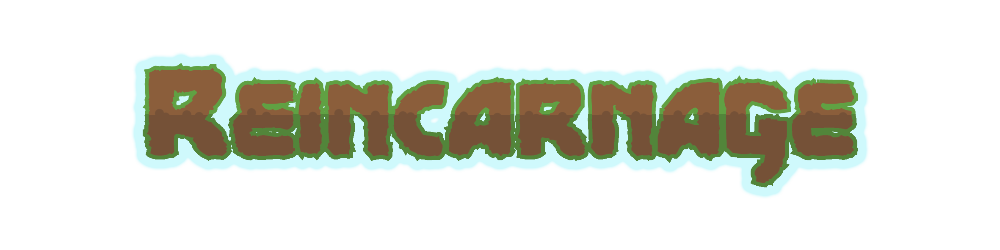
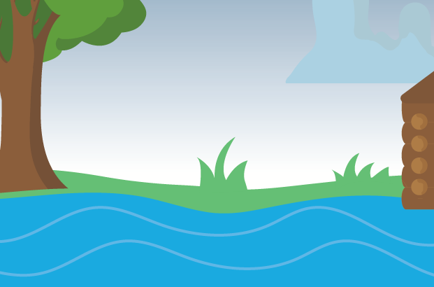
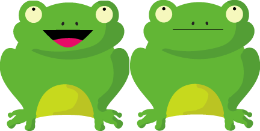
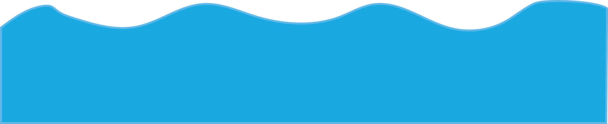
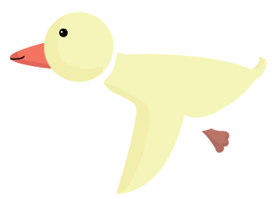
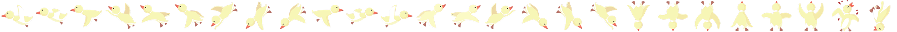

#My First Video Game

<br>

##Phaser JS

####You will learn to:

1. Create a game in PhaserJS
2. Import assets
3. Display and resize images/sprites
4. Play audio
5. Add physics to objects in the game
	* Gravity
	* Velocity
	* Bounce
6. Creat collision handlers
7. Set up controls
8. Animate sprites
9. Impress your friends
10. Win at life

<br>

##About Phaser

Phaser is a javascript library that makes it easy for us to create interactive video games in HTML.

No styling inside of the game is done with CSS. Instead you would load pre-made images (or sprites) and interact with them in HTML through Phaser.

Phaser is pretty basic compared with some of the better known gaming frameworks (impact, unreal, unity) but it is simple enough for us to make a pretty cool game very quickly. And we can win with Phaser since it's written in javascript and we already have high scores in javascript.

<br>

---
---

To discover some of the possibilites of phaser take a few minutes and play...

[](http://reincarnage.herokuapp.com)

####"because you are what you eat, but sometimes you are what eats you."

Reincarnage is a phaser game made by a me and a friend. It too was our first phaser game. 
[play it here](http://reincarnage.herokuapp.com)


----
----

#Today we are going recreate Level 3 of Reincarnage...

##SETUP

####To run the game:

1. Make sure you have sinatra and sinatra-reloader gems installed:

	`gem install sinatra`
	
	`gem install sinatra-reloader`
	
2. In your terminal CD into the game folder
	
	`/my_first_phaser_game`
	
3. Type the following command:

	`ruby game.rb`
	
4. Now in your browser (Google Chrome specifically) inter the following path:
	
	`localhost:4567`
	
--

#Let's begin to set up our level...

######We will be working exclusively in the file `/public/javascripts/app.js`

###What we start with.

Below we call a new Game instance and choose our canvas pixel size (1024, 768). After this we set our phaser physics to AUTO and inject functions for preload, create, and update.

in our ***app.js*** file...

```js
var game = new Phaser.Game(1024, 768, Phaser.AUTO, '', { preload: preload, create: create, update: update});

function preload() {
}

function create() {
}

function update() {
}
```
#The functions...

####Preload
- The preload function is where we import all of our assetts before we actually use them. In order for an assett (sprites, images, sounds, etc.) to be used in the game it must first be made available here.

####Create
- The create method is where we will add anything to our game that should be present UPON LOADING. This includes things like our level's background, our theme song, assignment of keystroke controls, and any static platforms/images.

####Update
- The update method is used to control litterally everything else that happens after the game's initialization. This is where we would create the functionality for new objects to be added to the game, collisions between existing objects, sound effects that occur through game interaction and so much more.

----
---

#Fly guy 

######Whenver you see this symbol (  ) it means you should refresh the page in your browser to see your latest cool changes! Let's refresh the browser now!
<br>

---
---

#####When you look at the browser you should see a blank black screen. This screen means that the phaser game is loaded and has created a canvas. This black screen will also be what you will see in the future if you have errors with your phaser code. So I guess for now it is the black screen of life.. but any other time it will be the black screen of death! :-)

Let's replace the dark abyss with something a bit more pretty.

##Chapter 1. The Background



####Images are preloaded within our *preload* function like this...

```js
function preload(){
	//we call on our game object and attach an image to it here
	//the first parameter is the variable name that we will refer to our image "background" and the second parameter is the filename of the image we are loading
	game.load.image('background', 'images/background.png');
}
```

####We can now add the image to our game canvas to make it appear when we start the game. We do this in our *create* function.

```js
function create(){
//When adding an image we give three parameters.
//The first is the x-axis position (from the left)
//the second is y-axis (from the top)
//and the third is the variable name of our preloaded image.
var background = game.add.image(0, 0, 'background');
}
```

###### Refresh the browser and see our background has loaded.

####But the size is an issue. Let's fix it.

```js
function create(){
var background = game.add.image(0, 0, 'background');
//this will increase our background image size by 87%
background.scale.x = game.rnd.realInRange(1.87, 1.87);
background.scale.y = game.rnd.realInRange(1.87, 1.87);
}
```

### "Very scenic"

######But we lost part of our logmill. Can we move the image over a bit? Of course we can...

####Change the x-axis position to -100 to give the image an offset.

```js
function create(){
var background = game.add.image(-100, 0, 'background');
background.scale.x = game.rnd.realInRange(1.87, 1.87);
background.scale.y = game.rnd.realInRange(1.87, 1.87);
}
```

### "Looking good!"

##Chapter 2. The Frog





####Preload:

```js
//Loading a spritesheet is like loading an image
//only in this case we will also specify the pixel width and height as arguments
game.load.spritesheet('froggy', 'images/frog.png', 216, 218);
```

######When adding objects to our canvas, we always want to keep order in mind. When you add two images, the one that is added first in the code will always have a lower z-index. So it would be a good idea to have our background added at the very top of our *create* method.

####Create:

```js
var background = game.add.image(-100, 0, 'background');
background.scale.x = game.rnd.realInRange(1.87, 1.87);
background.scale.y = game.rnd.realInRange(1.87, 1.87);

//Added after our background so that the frog is not hidden by the background
frog = game.add.sprite(175, 500, 'froggy')
```
### "See frog"

######GREAT SCOTT! That frog is ***big***! Let's fix that.
<br>

```js
frog = game.add.sprite(175, 500, 'froggy')
// Let's make our frog %18 of the size it is now.
frog.scale.x = game.rnd.realInRange(.18, .18);
frog.scale.y = game.rnd.realInRange(.18, .18);
```

### "See frog shrink"

`take a minute and play around with the frog's size`
	
###Enabling physics on our frog object

```js
frog = game.add.sprite(175, 500, 'froggy')
frog.scale.x = game.rnd.realInRange(.18, .18);
frog.scale.y = game.rnd.realInRange(.18, .18);
//Pass our frog into our game physics as an argument
game.physics.arcade.enable(frog);
//Give our frog downward (positive y-axis) gravity level of 1000
frog.body.gravity.y = 1000;
```
###  "See frog fall!"

`take a minute and play around with the frog's gravity`

###Adding sound!

Suddenly, and against all probability, a frog has been called into existence in mid air. And since this is not a naturally tenable position for a frog, this innocent creature has very little time to come to terms with it's identity. This is what it thought as it fell... "Ribbit"

######Let's give it a voice to express it's thoughts.

####Preload:

```js
//Similar to loading an image
game.load.audio('ribbit', 'sounds/ribbit.mp3');
```

####Create:

```js
var ribbit = game.add.audio('ribbit');
//Calling javascript's .play() within our create method will make sounds play the moment that the game begins
ribbit.play();
```

### "Hear frog speak"

##Chapter 3. The Water



It looks like our frog is falling off of the level. This looks generally janky. Lets fix that by adding an image within our level that our frog can "fall into".

####Preload:

```js
game.load.image('water', 'images/water.png');
```

####Create:

```js
//Be sure to add our water AFTER we add our frog
var water = game.add.image(-525, 625, 'water');
```

### "See frog swim"

##Chapter 4. The Rock


Our frog keeps getting flashed into existence only to fall into water. This is the some twisted form of recursive waterboard torture, and it needs to stop! 


Let's give our frog solid ground to stand on.

####Preload:

```js
game.load.image('rock', 'images/rock.png');
```

####Create:

```js
rock = game.add.sprite(105, 560, 'rock');
```

 If you created the rock AFTER the frog then you probably see the frog falling behind the rock only to emerge again just before hitting the water. This looks super janky. So move the rock above the frog in the code.

######Now let's give our rock physics

####Create:

```js
rock = game.add.sprite(105, 560, 'rock');
game.physics.arcade.enable(rock);
```

####Update:

```js
function update(){
	//Declaring an "on collide" function between two objects that are physics enabled.
	//We created both our rock and frog variables as global so that we could utilize them within the update function.
	game.physics.arcade.collide(frog, rock);
}
```

### "Frog beats rock?"
######That doesn't sound right. Let's fix it by making the rock an immovable object

####Create:

```js
rock = game.add.sprite(105, 560, 'rock');
game.physics.arcade.enable(rock);
rock.body.immovable = true;
```

### "See frog float?"

######This too seems wrong. Is this a levitating frog? Is it the messiah reincarnated as an amphibian? Dear God we must fix this janky looking game immediately!

##Chapter 5. The invisible ledge

Sometimes a vector sprite or image has extra invisible space around it. This makes collisions between images appear to occur before they actually touch. When this happens we can solve it by placing an invisible platform directly where we want our collision to happen.

Placing an invisible line can be hard... so I suggest first using a clearly visible line that will be the same size as your invisible one.


####Preload:

```js
//We load a purple line for our placeholder
game.load.image('line', 'images/purp_line.png');
```

####Create:

```js
rock = game.add.sprite(105, 560, 'rock');
//The physics can be removed from the rock, it is now unnecessary
//game.physics.arcade.enable(rock);
//rock.body.immovable = true;

ledge = game.add.sprite(140, 595, 'line');
game.physics.arcade.enable(ledge);
ledge.body.immovable = true;
```

####Update:

```js
function update(){
	//We change our collide interaction to now be between the frog and the ledge
	game.physics.arcade.collide(frog, ledge);
}
```

Now that we have our ledge positioned where we want it, we can switch from that offputting purple line to a nice clear line. This will give us the illusion that our froggy is on the rock.

```js
//We now load a blank line for our placeholder
game.load.image('line', 'images/blank_line.png');
```

### "See frog sit"
###"Sit frog. Sit"  

##Chapter 6. The Cloud


Watching a frog sit on a rock is cool and all. But wouldn't it be cooler if we had something animated happening? And wouldn't the frog be cooler if it had a cloud in the sky blocking the sunlight? Let's kill two birds with one cloud!

####Preload:

```js
game.load.image('cloud', 'images/cloud.png');
```

####Create:
Where does it make sense to add this to our canvas?

```js
cloud = game.add.sprite(335, -50, 'cloud');
game.physics.arcade.enable(cloud);
//Give our cloud right (positive x-axis) velocity level of 5
cloud.body.velocity.x = 5;
```

### "Now we're moving!"

`take a minute and play with the velocity of the cloud`
	
##Chapter 7. The Bird




####Preload:

```js
game.load.spritesheet('bird', 'images/bird1.png', 84, 80);
```

####Create:

```js
//Add it
birdie = game.add.sprite(750, -30, 'bird');
//Resize it
birdie.scale.x = game.rnd.realInRange(1.8, 1.8);
birdie.scale.y = game.rnd.realInRange(1.8, 1.8);
//Give it physics
game.physics.arcade.enable(birdie);
//Make it move
birdie.body.velocity.x = -180;
```

### "Bye bye birdie!"

######How can we make it so that our bird stays on screen?

```js
//Collide function between bird and world boundry will stop the bird in it's tracks
  birdie.body.collideWorldBounds = true;
```

### "A bird in the bush"

######How about we keep the bird moving by adding a bounce attribute to it's physics?!

```js
birdie.body.bounce.setTo(1, 1);
```

### "Bird is the word"

`take a minute to play around with the birds bounce setting`

###"Is this a hummingbird?"

######Our bird is gliding around backwards. And it isn't even flapping it's wing. We must fix this! But how?

##Chapter 8. The Animation

When phaser preloads a spritesheet it automatically chops up all of its images based on the width you gave it. What results is an array of images that each have their own index value. The frog sprite is really simple. It only has two images, one with an open mouth and one closed. Let's set it up so that he can breathe. 

####Create:

```js
//Parameters for animation
//(the animation variable name,
//a new array of the sprite image indices you wish to cycle through,
//the speed of the cycle,
//and whether or not the cycle will repeat)
frog.animations.add('openClose', [0, 1], 2, true);
//How we call the animation
frog.animations.play('openClose');
```

### "See frog breathe"

######Now for our bird

Lets add a simple left animation for our bird. The bird is a bit more complex, having way more than two images.



```js
//The first three images of our bird sprite are facing due left
birdie.animations.add('left', [0, 1, 2], 6, true);
birdie.animations.play('left')
```
### "Lame duck"

######Do you see how the birds wing appears to jump from the bottom to the top every animation cycle? Perhaps it would be smoother if we repeated the middle image again at the end of the cycle.

```js
//Adding image index 1 again in the loop
birdie.animations.add('left', [0, 1, 2, 1], 6, true);
```

### "Smooth sailing"

`take a minute to play around with the bird animation`

######Now let's get the bird to fly to the right when it's moving to the right.

####Create:
```js
birdie.animations.add('right', [9, 10, 11, 10], 6, true);
```

Now for the hard part. We want to have our bird animate depending on which way it is travelling. To measure it's trajectory we can actually use the velocity that it is travelling in. Remember when we added a x-velocity of -180 to our bird? Well every time that it is bouncing off of the wall at (1, 1) it is reversing it's velocity. Meaning that it goes from -180 to 180 and back. We can create conditionals that measure this and play the correct animations accordingly.

####Update:

```js
if (birdie.body.velocity.x >= 180){
	birdie.animations.play('right')
} else {
	birdie.animations.play('left')
}
```

### "Them crooked vultures"

######"Hey wait? This is a game right? How come I can't play anything yet?"

##Chapter 9. The Controls

You can set up any keys or mouse clicks as controls in Phaser. For now we will just set up the direction keys.

####Create:
```js
//This will make up,down,left,and right live our keyboard
cursors = game.input.keyboard.createCursorKeys();
```

Now we can use these controls in our update function.

####Update:
```js
//.isDown is checking if a key "is (pressed) down"
if (cursors.left.isDown) {
	birdie.body.velocity.x = -180;
} else if (cursors.right.isDown) {
	birdie.body.velocity.x = 180
}
```

### "Dance puppet. Dance!"

##Chapter 10. Putting it all together

Let's make our bird fully animated and controllable. Replace the code we have made for our bird animations and controls with the following code:

####Create:

```js
birdie.animations.add('left', [0, 1, 2, 1], 6, true);
birdie.animations.add('right', [9, 10, 11, 10], 6, true);
birdie.animations.add('down', [18, 19, 20, 19], 6, true);
birdie.animations.add('left_down', [6, 7, 8, 7], 6, true);
birdie.animations.add('right_down', [15, 16, 17, 16], 6, true);
birdie.animations.add('up', [21, 22, 23, 22], 6, true);
birdie.animations.add('left_up', [3, 4, 5, 4], 6, true);
birdie.animations.add('right_up', [12, 13, 14, 13], 6, true);
```

####Update:
adding animations

```js
//animations
if (birdie.body.velocity.x >= 180 && birdie.body.velocity.y >= 180) {
        birdie.animations.play('right_down')
} else if (birdie.body.velocity.x <= -180 && birdie.body.velocity.y >= 180) {
    birdie.animations.play('left_down')
} else if (birdie.body.velocity.x >= 180 && birdie.body.velocity.y <= -180) {
    birdie.animations.play('right_up')
} else if (birdie.body.velocity.x <= -180 && birdie.body.velocity.y <= -180) {
    birdie.animations.play('left_up')
} else if (birdie.body.velocity.x >= 140) {
    birdie.animations.play('right')
} else if (birdie.body.velocity.x <= -140) {
    birdie.animations.play('left')
} else if (birdie.body.velocity.y > 0 && (birdie.body.velocity.x < 140 && birdie.body.velocity.x > -140)) {
    if (birdie.body.velocity.y < 600) {
        birdie.animations.play('down')
    } else {
        birdie.animations.play('fall')
    }
}
else if (birdie.body.velocity.y < 0 && (birdie.body.velocity.x < 140 && birdie.body.velocity.x > -140)) {
    birdie.animations.play('up')
}
```
adding controls

```js
if (cursors.up.isDown) {
    if (cursors.left.isDown) {

        birdie.body.velocity.y = -180;
        birdie.body.velocity.x = -180;

    } else if (cursors.right.isDown) {

        birdie.body.velocity.y = -180;
        birdie.body.velocity.x = 180;

    } else {

        birdie.body.velocity.y = -180;
        birdie.body.velocity.x *= .99;
    }

  } else if (cursors.down.isDown) {

      if (cursors.left.isDown) {

          birdie.body.velocity.y = 180;
          birdie.body.velocity.x = -180;

      } else if (cursors.right.isDown) {

          birdie.body.velocity.y = 180;
          birdie.body.velocity.x = 180;

      } else {
          birdie.body.velocity.y = 180;
          birdie.body.velocity.x *= .99;
      }

  } else if (cursors.left.isDown) {
      birdie.body.velocity.x = -180;
      birdie.body.velocity.y *= .5;

  } else if (cursors.right.isDown) {
      birdie.body.velocity.x = 180;
      birdie.body.velocity.y *= .5;
  }
```


<br>

<br>

##References

Check out [phaser.io](http://phaser.io) to see some cool examples of what you can make using Phaser.

##Reincarnage

As seen at [NYC Games Forum: August Demo Night '15](http://www.eventbrite.com/e/nyc-games-forum-august-demo-night-tickets-12470538717)

View the code on [Github](https://github.com/keyanbagheri/reincarnage)

Created by: [Keyan Bagheri](https://github.com/keyanbagheri) & [Ben Ticsay](https://github.com/benticsay)

Illustrations by: [Kathy Geisel](http://www.kathygeisel.com/)

<br>

<br>

 Tutorial by: [Keyan Bagheri](http://keyanbagheri.com) - 7/1/2015 